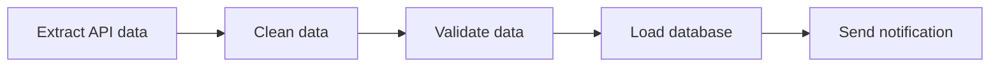
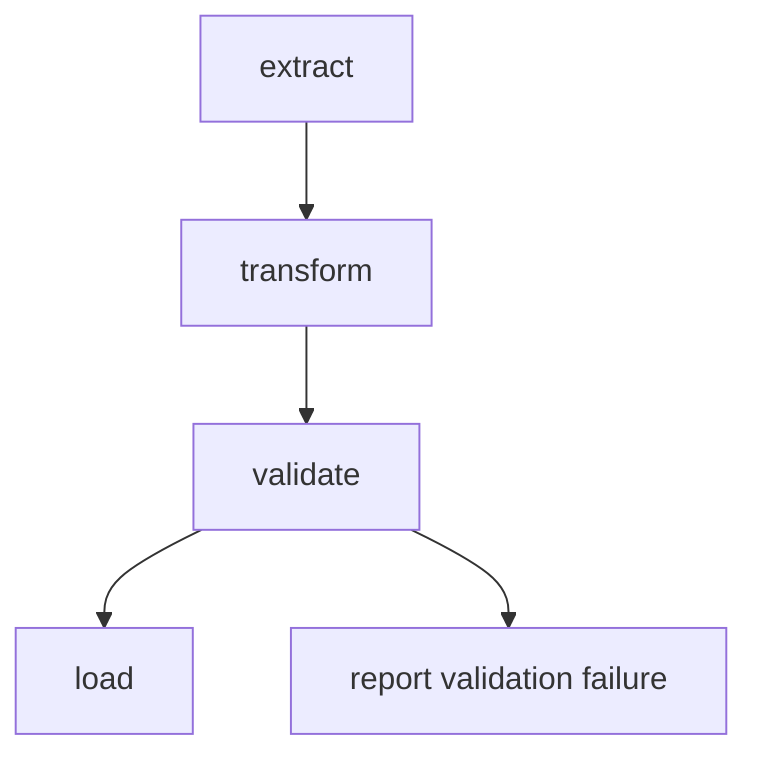
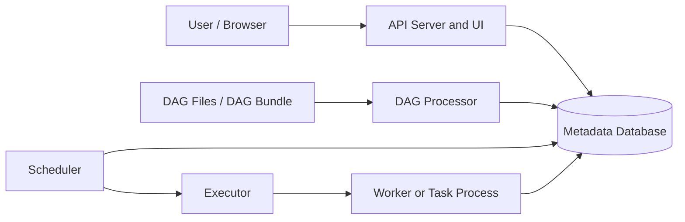
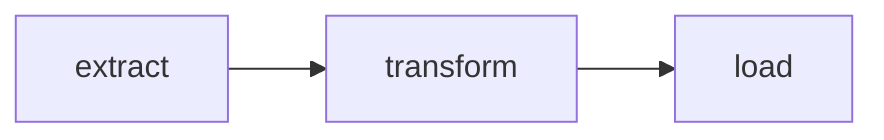
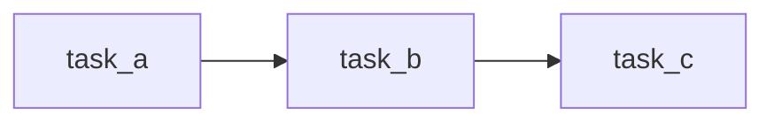
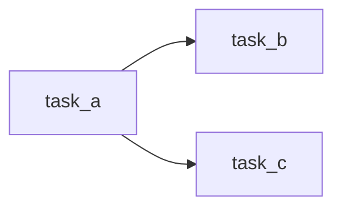
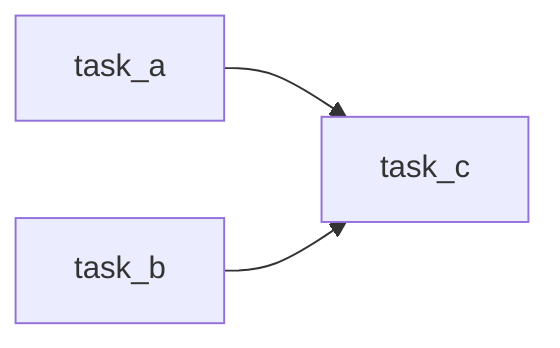
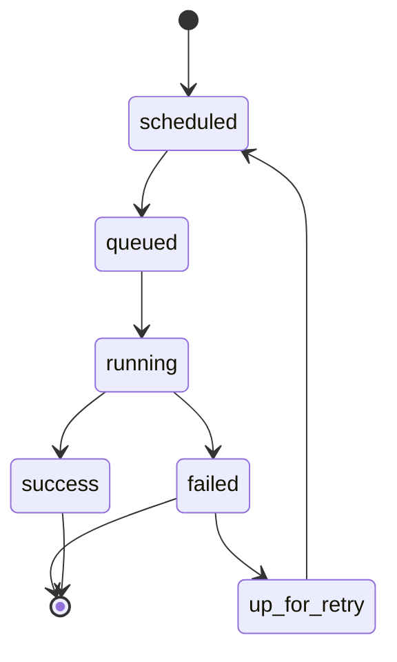

# Apache Airflow: A Basic, Neat Guide

**Purpose:** A beginner-friendly introduction to Apache Airflow, its main concepts, local setup, DAG authoring, testing, and basic good practices.

> **Version note:** The linked tutorial was written for an older Airflow release. This guide preserves its core concepts but modernizes the examples for current Airflow 3.x syntax and architecture.

---

## 1. What Is Apache Airflow?

Apache Airflow is a workflow-orchestration platform.

It is used to define, schedule, run, and monitor workflows such as:

- ETL and ELT pipelines,
- machine-learning pipelines,
- report generation,
- database maintenance,
- API data collection,
- file processing,
- and cloud jobs.

Airflow does not usually perform all of the data processing itself. Instead, it coordinates tasks that run:

- Python functions,
- shell commands,
- SQL queries,
- containers,
- cloud services,
- or other external systems.

### Simple example

A daily pipeline might:

1. download data from an API,
2. clean the data,
3. validate the data,
4. load it into a database,
5. and send a completion notification.



The arrows describe dependencies. Airflow ensures that downstream tasks wait for the required upstream tasks.

---

## 2. Why Use Airflow?

Airflow is useful when a workflow has:

- multiple tasks,
- dependencies,
- a schedule,
- retries,
- monitoring requirements,
- or a need for historical execution records.

Airflow provides:

- scheduling,
- dependency management,
- retries,
- task-state tracking,
- logs,
- a web interface,
- manual triggering,
- backfills,
- and reusable integrations.

### Airflow is especially useful when

- task B must wait for task A,
- a failed task should retry automatically,
- a pipeline must run every day,
- operators need to inspect past runs,
- or several systems must be coordinated.

### Airflow is not primarily intended for

- continuously streaming every individual event,
- very small one-time scripts,
- replacing a database,
- or performing low-latency request handling.

---

# 3. Core Airflow Vocabulary

## DAG

A **DAG** is a Directed Acyclic Graph.

It describes:

- which tasks exist,
- how the tasks depend on each other,
- and the order in which they may run.

A DAG cannot contain a cycle.

Invalid:

```text
A → B → C → A
```

Valid:

```text
A → B → C
```

A workflow needs a completion path, so tasks cannot depend on themselves through a loop.

---

## Task

A **task** is one unit of work.

Examples:

- call an API,
- run a Python function,
- execute SQL,
- wait for a file,
- send an email,
- or run a Bash command.

---

## Operator

An **operator** is a reusable task template.

Examples include:

- `BashOperator`,
- `PythonOperator`,
- `EmailOperator`,
- `HttpOperator`,
- `SQLExecuteQueryOperator`,
- and `KubernetesPodOperator`.

Modern Airflow also supports the TaskFlow `@task` decorator, which turns a Python function into an Airflow task.

---

## Sensor

A **sensor** is a task that waits for something to happen.

Examples:

- a file appears,
- a database row exists,
- another DAG finishes,
- or a cloud object becomes available.

---

## Task instance

A **task instance** is one specific execution of one task in one DAG run.

For example:

```text
Task: clean_data
DAG run: 2026-07-10
```

That combination is one task instance.

Common task-instance states include:

- `scheduled`,
- `queued`,
- `running`,
- `success`,
- `failed`,
- `skipped`,
- and `up_for_retry`.

---

## DAG run

A **DAG run** is one complete execution of a DAG.

A daily DAG creates a separate DAG run for each scheduled data interval.

---

## Upstream and downstream

Given:

```text
extract → transform → load
```

- `extract` is upstream of `transform`.
- `load` is downstream of `transform`.

By default, a task waits until all of its direct upstream tasks succeed.

---

# 4. A Simple DAG Diagram



This diagram means:

- `transform` waits for `extract`,
- `validate` waits for `transform`,
- and the later tasks depend on the validation path and trigger rules.

---

# 5. Airflow Architecture

A modern Airflow installation includes several cooperating components.



## API server and web UI

Provides:

- the Airflow user interface,
- the REST API,
- DAG inspection,
- task logs,
- manual triggering,
- and debugging tools.

Older Airflow material often calls this simply the **web server**.

---

## Scheduler

The scheduler:

- examines DAG schedules,
- checks task dependencies,
- creates scheduled task instances,
- and submits runnable tasks to the executor.

---

## Executor

The executor determines how tasks are run.

Examples include:

- local task processes,
- Celery workers,
- or Kubernetes pods.

In modern Airflow, the executor is a scheduler configuration rather than a completely independent top-level service.

---

## DAG processor

The DAG processor:

- reads DAG Python files,
- imports and parses them,
- and stores serialized DAG information.

DAG files should therefore parse quickly and should not perform expensive work at import time.

---

## Metadata database

Stores Airflow’s operational state, including:

- DAG runs,
- task instances,
- variables,
- connections,
- schedules,
- and other metadata.

For local learning, Airflow can use SQLite. Production systems normally use an external database such as PostgreSQL or MySQL.

---

## Workers

Workers execute tasks when using distributed executors such as Celery or Kubernetes-based setups.

A small local installation may run tasks in local processes instead.

---

# 6. Workflow as Code

Airflow workflows are Python code.

This makes DAGs:

- versionable,
- testable,
- reviewable,
- reusable,
- and collaborative.

A DAG file should define the workflow rather than perform the workflow immediately.

Avoid expensive top-level code such as:

```python
# Avoid this at module import time.
data = download_large_dataset()
```

Place runtime work inside tasks instead.

---

# 7. Idempotency

An idempotent task produces the same intended final result when it is run more than once with the same input.

This matters because Airflow may retry a failed task.

## Non-idempotent example

```sql
INSERT INTO daily_totals
SELECT * FROM staging_totals;
```

A retry may create duplicates.

## Safer pattern

Use:

- an upsert,
- a merge,
- a partition replacement,
- or a deterministic output path.

```sql
MERGE INTO daily_totals AS target
USING staging_totals AS source
ON target.report_date = source.report_date
WHEN MATCHED THEN
    UPDATE SET total = source.total
WHEN NOT MATCHED THEN
    INSERT (report_date, total)
    VALUES (source.report_date, source.total);
```

## Idempotency checklist

A retry should not:

- create duplicate database rows,
- append the same file twice,
- send an unintended duplicate notification,
- or read changing “latest” data when a fixed partition is expected.

Prefer processing a specific data interval or partition.

---

# 8. Local Installation

## Important platform note

For Windows, use WSL2 or a Linux-based container environment. Native Windows installation is not the normal supported path.

## Option A: Python virtual environment and `pip`

The exact Airflow and Python versions must match an official constraints file.

```bash
# Optional Airflow home
export AIRFLOW_HOME=~/airflow

# Create and activate a virtual environment
python3 -m venv airflow_venv
source airflow_venv/bin/activate

# Upgrade pip
python -m pip install --upgrade pip

# Choose a supported Airflow version
AIRFLOW_VERSION=3.3.0

# Detect the current Python major/minor version
PYTHON_VERSION="$(python -c 'import sys; print(f"{sys.version_info.major}.{sys.version_info.minor}")')"

# Build the matching constraints URL
CONSTRAINT_URL="https://raw.githubusercontent.com/apache/airflow/constraints-${AIRFLOW_VERSION}/constraints-${PYTHON_VERSION}.txt"

# Install reproducibly
pip install "apache-airflow==${AIRFLOW_VERSION}" \
    --constraint "${CONSTRAINT_URL}"

# Confirm installation
airflow version
```

## Option B: `uv`

After installing `uv`:

```bash
export AIRFLOW_HOME=~/airflow

AIRFLOW_VERSION=3.3.0
PYTHON_VERSION="$(python -c 'import sys; print(f"{sys.version_info.major}.${sys.version_info.minor}")')"
CONSTRAINT_URL="https://raw.githubusercontent.com/apache/airflow/constraints-${AIRFLOW_VERSION}/constraints-${PYTHON_VERSION}.txt"

uv pip install "apache-airflow==${AIRFLOW_VERSION}" \
    --constraint "${CONSTRAINT_URL}"
```

> Airflow has many tightly coordinated dependencies. Use the official constraints file rather than installing an unconstrained dependency set.

---

# 9. Start Airflow Locally

Run:

```bash
airflow standalone
```

This command is designed for learning and local development. It:

- initializes the metadata database,
- creates a local administrator,
- starts the required components,
- and serves the UI.

Open:

```text
http://localhost:8080
```

Airflow may store the generated local password in:

```text
$AIRFLOW_HOME/simple_auth_manager_passwords.json.generated
```

Read it with:

```bash
cat "$AIRFLOW_HOME/simple_auth_manager_passwords.json.generated"
```

> `airflow standalone` is convenient for local learning, not a production deployment pattern.

---

# 10. The DAG Folder

The default Airflow home is usually:

```text
~/airflow
```

A typical local layout is:

```text
~/airflow/
├── airflow.cfg
├── airflow.db
├── dags/
├── logs/
└── simple_auth_manager_passwords.json.generated
```

Place DAG files inside:

```text
$AIRFLOW_HOME/dags/
```

Example:

```text
~/airflow/dags/hello_airflow.py
```

---

# 11. First DAG: TaskFlow API

The TaskFlow API is the recommended, Pythonic way to create tasks from ordinary Python functions.

Create:

```text
$AIRFLOW_HOME/dags/basic_etl.py
```

Add:

```python
from __future__ import annotations

from datetime import datetime

from airflow.sdk import dag, task


@dag(
    dag_id="basic_etl",
    schedule=None,
    start_date=datetime(2025, 1, 1),
    catchup=False,
    tags=["tutorial"],
)
def basic_etl():
    """A small extract-transform-load example."""

    @task
    def extract() -> list[int]:
        """Return example source data."""
        return [2, 4, 6, 8]

    @task
    def transform(values: list[int]) -> list[int]:
        """Square each input value."""
        return [
            value**2
            for value in values
        ]

    @task
    def load(values: list[int]) -> None:
        """Display the transformed values."""
        print(
            f"Loaded values: {values}"
        )

    raw_values = extract()
    transformed_values = transform(
        raw_values
    )
    load(transformed_values)


basic_etl()
```

---

# 12. What the First DAG Code Does

## `@dag`

```python
@dag(...)
```

Turns the decorated function into a DAG factory.

## `dag_id`

```python
dag_id="basic_etl"
```

The unique identifier displayed in the UI and CLI.

## `schedule=None`

The DAG does not run automatically. Trigger it manually.

Other examples:

```python
schedule="@daily"
schedule="@hourly"
```

## `start_date`

Defines the beginning of scheduling logic and data intervals.

It is not simply “run immediately at this wall-clock time.”

## `catchup=False`

Prevents Airflow from automatically creating historical scheduled runs between `start_date` and the present.

## `@task`

Turns each Python function into an Airflow task.

## Task calls inside the DAG

```python
raw_values = extract()
```

This does not execute the Python function while the DAG file is parsed.

It creates a task and an output reference.

## Passing task output

```python
transform(raw_values)
```

TaskFlow automatically uses Airflow’s task-communication mechanism to pass the small result.

---

# 13. DAG Dependency Diagram

The TaskFlow function calls create this dependency structure:



Equivalent explicit dependency notation with operator-based tasks would be:

```python
extract_task >> transform_task >> load_task
```

---

# 14. Classic Operator Example

Airflow also supports operator-based DAGs.

```python
from __future__ import annotations

from datetime import datetime, timedelta

from airflow.providers.standard.operators.bash import BashOperator
from airflow.sdk import DAG


with DAG(
    dag_id="basic_bash",
    schedule=None,
    start_date=datetime(2025, 1, 1),
    catchup=False,
    default_args={
        "retries": 2,
        "retry_delay": timedelta(
            minutes=1
        ),
    },
    tags=["tutorial"],
) as dag:

    print_date = BashOperator(
        task_id="print_date",
        bash_command="date",
    )

    print_message = BashOperator(
        task_id="print_message",
        bash_command=(
            'echo "Airflow task complete"'
        ),
    )

    print_date >> print_message
```

Use operators when a provider already offers the integration you need.

Use `@task` for straightforward Python callables.

---

# 15. Operators, Tasks, and Providers

Providers are installable Airflow packages for external systems.

They may contain:

- operators,
- hooks,
- sensors,
- and transfer utilities.

Examples:

- AWS,
- Google Cloud,
- Microsoft Azure,
- PostgreSQL,
- Snowflake,
- Slack,
- Docker,
- and Kubernetes.

Modern equivalents to names shown in older tutorials include:

| Older tutorial name | Modern direction |
|---|---|
| `SimpleHttpOperator` | `HttpOperator` |
| `MySqlOperator` | Often `SQLExecuteQueryOperator` |
| Python callable with `provide_context=True` | TaskFlow `@task` or runtime context APIs |
| Standalone web server terminology | API server and UI in Airflow 3 |

Provider imports vary by package and installed version.

---

# 16. Defining Dependencies

## Linear chain

```python
task_a >> task_b >> task_c
```



## Fan-out

```python
task_a >> [
    task_b,
    task_c,
]
```



## Fan-in

```python
[
    task_a,
    task_b,
] >> task_c
```



The `>>` operator means “is upstream of.”

The `<<` operator expresses the same relationship in reverse.

---

# 17. Scheduling Basics

Common schedules:

```python
schedule=None
```

Manual only.

```python
schedule="@daily"
```

Once per day.

```python
schedule="@hourly"
```

Once per hour.

A cron expression may also be used:

```python
schedule="0 6 * * *"
```

This means 6:00 each day in the DAG’s configured timezone.

---

# 18. Logical Dates and Data Intervals

Airflow scheduling is based on logical data intervals.

For a daily DAG:

```text
Data interval:
2026-07-09 00:00
to
2026-07-10 00:00
```

The run is normally scheduled after the interval is complete.

This allows the pipeline to process a complete daily partition.

Use Airflow’s interval values rather than `datetime.now()` for partition-critical logic.

Conceptually:

```python
partition_date = data_interval_start
```

This keeps retries reproducible.

---

# 19. Passing Data Between Tasks

TaskFlow can pass small serializable values between tasks.

```python
@task
def extract():
    return {
        "rows": 100,
        "source": "api",
    }


@task
def report(metadata):
    print(metadata["rows"])


report(extract())
```

Airflow stores this communication through XCom.

## Do not use XCom for large datasets

Avoid passing:

- full DataFrames,
- large files,
- massive JSON payloads,
- or binary datasets.

Instead:

1. store the data in durable shared storage,
2. pass the path, table name, object key, or identifier.

Example:

```python
@task
def extract() -> str:
    output_path = (
        "s3://example-bucket/"
        "raw/2026-07-10/data.parquet"
    )
    # Write data to output_path.
    return output_path
```

---

# 20. Atomic Tasks

A good task performs one complete unit of work.

Good:

```text
extract_partition
validate_partition
load_partition
```

Less useful:

```text
do_everything
```

Atomic tasks improve:

- retries,
- monitoring,
- debugging,
- reuse,
- and failure isolation.

A task should not leave incomplete output if it fails.

A common pattern is:

1. write to a temporary location,
2. validate,
3. atomically rename or promote the result.

---

# 21. Retries

Retries can be configured in `default_args`:

```python
from datetime import timedelta


default_args = {
    "retries": 3,
    "retry_delay": timedelta(
        minutes=5
    ),
}
```

Or per task.

Retries are appropriate for temporary failures such as:

- API timeouts,
- transient database errors,
- rate limits,
- or temporary network issues.

Retries are not a substitute for fixing:

- invalid SQL,
- bad credentials,
- broken schemas,
- or deterministic code errors.

---

# 22. Testing a DAG

## Parse the Python file

```bash
python "$AIRFLOW_HOME/dags/basic_etl.py"
```

No output is required. The important result is that no exception occurs.

## List DAGs

```bash
airflow dags list
```

## List tasks

```bash
airflow tasks list basic_etl
```

## Show the DAG structure

```bash
airflow dags show basic_etl
```

## Test one task

```bash
airflow tasks test \
    basic_etl \
    extract \
    2026-07-10
```

## Test the entire DAG locally

```bash
airflow dags test \
    basic_etl \
    2026-07-10
```

Task and DAG test commands run locally and are useful before relying on the scheduler.

---

# 23. Using the Airflow UI

The UI allows you to:

- enable or disable DAGs,
- trigger a run,
- inspect task status,
- view dependencies,
- read task logs,
- clear failed tasks,
- retry tasks,
- inspect run history,
- and review task duration.

Useful views include:

## Grid view

Shows task states across DAG runs.

## Graph view

Shows the dependency graph.

## Task logs

Show output and exceptions from one task instance.

## DAG details

Show scheduling, tags, and recent run information.

---

# 24. Basic Task-State Flow



The exact lifecycle can include additional states, but this is the usual beginner-level flow.

---

# 25. Basic Best Practices

## 25.1 Keep tasks idempotent

Retries should not create duplicate or inconsistent results.

## 25.2 Avoid heavy top-level DAG code

The DAG processor imports DAG files repeatedly.

Keep imports and DAG construction lightweight.

## 25.3 Keep tasks atomic

A failure should identify a clear unit of work.

## 25.4 Use durable shared storage

Distributed tasks may run on different machines.

Do not assume one task’s local filesystem is visible to another.

Use:

- object storage,
- a database,
- a shared filesystem,
- or another durable system.

## 25.5 Pass references, not large data

Use XCom for small metadata and identifiers.

## 25.6 Set retries deliberately

Retry temporary failures, not deterministic bugs.

## 25.7 Use meaningful IDs

Good:

```text
extract_orders
validate_orders
load_orders
```

Weak:

```text
task1
task2
task3
```

## 25.8 Use time-zone-aware scheduling

Prefer a clearly defined timezone, especially for business schedules.

## 25.9 Test DAG parsing

A syntax or import error can prevent a DAG from appearing.

## 25.10 Keep secrets out of DAG code

Use Airflow connections, a secrets backend, or environment-managed configuration.

Do not hard-code:

- passwords,
- cloud keys,
- tokens,
- or database credentials.

---

# 26. Common Beginner Problems

## DAG does not appear in the UI

Check:

```bash
airflow dags list
```

Then run the DAG file directly:

```bash
python "$AIRFLOW_HOME/dags/basic_etl.py"
```

Common causes:

- syntax error,
- missing provider package,
- wrong DAG folder,
- import error,
- or the file does not create a DAG object.

---

## Task remains queued

Possible causes:

- no available worker,
- executor configuration,
- pool limits,
- concurrency limits,
- or worker resource problems.

---

## Task retries repeatedly

Read the task log.

Determine whether the failure is:

- transient,
- permission-related,
- configuration-related,
- or deterministic.

Do not increase retries without understanding the cause.

---

## Import error for an operator

The operator may belong to a provider package that is not installed.

Install the correct provider while pinning Airflow to the existing version.

---

## Data exists locally but the next task cannot find it

The tasks may be running on different workers.

Write shared data to durable storage and pass its location.

---

## DAG creates too many historical runs

Check:

```python
catchup=False
```

Also review:

- `start_date`,
- the schedule,
- and manual backfill behavior.

---

# 27. Airflow Versus a Normal Python Script

| Need | Python script | Airflow |
|---|---:|---:|
| One-time sequence | Excellent | Usually unnecessary |
| Scheduled execution | Requires external scheduler | Built in |
| Task dependencies | Manual code | Built in |
| Retries | Manual code | Built in |
| Historical run UI | No | Yes |
| Distributed execution | Additional work | Supported |
| Task logs | Custom setup | Built in |
| Backfills | Custom setup | Supported |
| Operational metadata | Custom setup | Built in |

Airflow is most valuable when orchestration complexity is significant.

---

# 28. Airflow Versus Luigi

The linked tutorial compares Airflow with Luigi.

Both systems:

- are Python-based,
- model task dependencies,
- support data pipelines,
- and track success or failure.

At a basic level:

- Airflow emphasizes scheduling, orchestration, an operational UI, and a large provider ecosystem.
- Luigi historically emphasizes target-based completion and dependency-driven batch processing.

For a new project, evaluate current project activity, team experience, deployment needs, and integration requirements rather than relying only on older comparisons.

---

# 29. Suggested Beginner Project

Create a three-task daily pipeline:


Recommended learning goals:

1. define a DAG,
2. use `@task`,
3. pass a small file path,
4. set dependencies,
5. trigger manually,
6. inspect logs,
7. force one task to fail,
8. observe a retry,
9. fix the code,
10. rerun the failed task.

---

# 30. Small Practice DAG

```python
from __future__ import annotations

import csv
import json
from datetime import datetime
from pathlib import Path

from airflow.sdk import dag, task


DATA_DIR = Path("/tmp/airflow_demo")


@dag(
    dag_id="csv_summary_demo",
    schedule=None,
    start_date=datetime(2025, 1, 1),
    catchup=False,
    tags=["practice"],
)
def csv_summary_demo():

    @task
    def create_csv() -> str:
        DATA_DIR.mkdir(
            parents=True,
            exist_ok=True,
        )

        file_path = (
            DATA_DIR / "sales.csv"
        )

        rows = [
            {"item": "A", "amount": 10},
            {"item": "B", "amount": 15},
            {"item": "C", "amount": 25},
        ]

        with file_path.open(
            "w",
            newline="",
            encoding="utf-8",
        ) as file_object:
            writer = csv.DictWriter(
                file_object,
                fieldnames=[
                    "item",
                    "amount",
                ],
            )
            writer.writeheader()
            writer.writerows(rows)

        return str(file_path)

    @task
    def summarize(
        input_path: str,
    ) -> dict[str, int]:
        total = 0
        row_count = 0

        with Path(input_path).open(
            encoding="utf-8",
        ) as file_object:
            reader = csv.DictReader(
                file_object
            )

            for row in reader:
                total += int(
                    row["amount"]
                )
                row_count += 1

        return {
            "row_count": row_count,
            "total": total,
        }

    @task
    def write_summary(
        summary: dict[str, int],
    ) -> str:
        output_path = (
            DATA_DIR / "summary.json"
        )

        output_path.write_text(
            json.dumps(
                summary,
                indent=2,
            ),
            encoding="utf-8",
        )

        return str(output_path)

    csv_path = create_csv()
    summary = summarize(csv_path)
    write_summary(summary)


csv_summary_demo()
```

> This local-file example is suitable for a single-machine learning environment. In a distributed deployment, use shared durable storage instead of `/tmp`.

---

# 31. Quick Command Reference

```bash
# Start local Airflow
airflow standalone

# Show version
airflow version

# Initialize or migrate metadata tables
airflow db migrate

# List DAGs
airflow dags list

# List tasks in a DAG
airflow tasks list basic_etl

# Show DAG graph
airflow dags show basic_etl

# Test one task
airflow tasks test basic_etl extract 2026-07-10

# Test an entire DAG
airflow dags test basic_etl 2026-07-10
```

---

# 32. Quick Concept Reference

| Concept | Meaning |
|---|---|
| DAG | Workflow structure |
| Task | One unit of work |
| Operator | Reusable task template |
| Sensor | Task that waits for an event |
| TaskFlow | Python functions converted to tasks |
| DAG run | One workflow execution |
| Task instance | One task execution in one DAG run |
| Scheduler | Decides what should run |
| Executor | Determines how tasks are launched |
| Worker | Executes tasks in distributed setups |
| Metadata database | Stores Airflow state |
| XCom | Small cross-task messages |
| Provider | Integration package |
| Upstream | Required earlier task |
| Downstream | Dependent later task |
| Catchup | Creation of historical scheduled runs |
| Idempotent | Safe to rerun with the same intended result |

---

# 33. Recommended Learning Order

1. Understand DAGs and dependencies.
2. Run `airflow standalone`.
3. Create one TaskFlow DAG.
4. Trigger it manually.
5. inspect Grid and Graph views.
6. inspect task logs.
7. add retries.
8. test through the CLI.
9. add one provider integration.
10. learn connections and secrets.
11. learn data intervals and scheduling.
12. learn sensors and branching.
13. learn production deployment only after the basics are comfortable.

---

# 34. Final Takeaways

- Airflow orchestrates workflows; it is not the data store or processing engine itself.
- A DAG defines tasks and dependencies.
- A task instance is one task run inside one DAG run.
- Modern Python tasks are commonly created with the TaskFlow `@task` decorator.
- The scheduler decides when tasks are ready.
- The executor and workers determine how tasks run.
- The metadata database stores operational state.
- DAG files should parse quickly and avoid top-level processing.
- Tasks should be atomic and idempotent.
- Use XCom for small values, not large datasets.
- Store shared data in durable external storage.
- Use retries only for failures that may succeed later.
- Test DAGs and tasks from the CLI before depending on schedules.
- Local standalone mode is for learning, not production.
- Older Airflow tutorials may contain imports and architecture descriptions that need modernization.

---

## Source Note

This guide was built from the linked **Airflow Basics** tutorial and checked against the current Apache Airflow documentation for:

- architecture,
- core concepts,
- TaskFlow,
- operators,
- installation,
- testing,
- and best practices.
